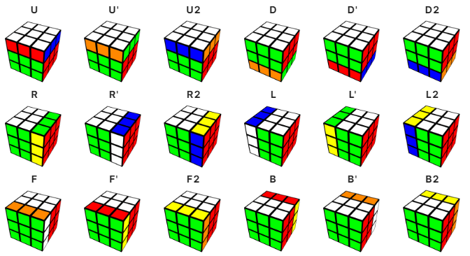

<!-- -*- coding: iso-8859-1 -*- -->
<div id="top"></div>

<div align="center">
  <a href="#">
    
  </a>

  <h3 align="center">Cubo Rubik</h3>

  <p align="center">
    Cubo Rubik desarrollado con OpenGL
  </p>
</div>


<!-- TABLE OF CONTENTS -->
<details>
  <summary>Tabla de Contenido</summary>
  <ol>    
    <li>
      <a href="#getting-started">Getting Started</a>
      <ul>
        <li><a href="#prerequisites">Prerequisites</a></li>
        <li><a href="#installation">Installation</a></li>
      </ul>
    </li>    
    <li><a href="#notacion-del-cubo-rubik">Notación del Cubo Rubik</a></li>
  </ol>
</details>


<!-- GETTING STARTED -->
## Getting Started

This is an example of how you may give instructions on setting up your project locally.
To get a local copy up and running follow these simple example steps.

### Prerequisites

This is an example of how to list things you need to use the software and how to install them.
* npm
  ```sh
  npm install npm@latest -g
  ```

### Installation

_Below is an example of how you can instruct your audience on installing and setting up your app. This template doesn't rely on any external dependencies or services._

1. Get a free API Key at [https://example.com](https://example.com)
2. Clone the repo
   ```sh
   git clone https://github.com/your_username_/Project-Name.git
   ```
3. Install NPM packages
   ```sh
   npm install
   ```
4. Enter your API in `config.js`
   ```js
   const API_KEY = 'ENTER YOUR API';
   ```

<p align="right">(<a href="#top">back to top</a>)</p>

## Notacion del Cubo Rubik
* Las rotaciones de una sola letra se realizan en el sentido de las agujas del reloj (Clockwise).
* Las rotaciones que tienen el símbolo primo ('), se realizan en sentido contrario a las agujas del reloj.
* Mire directamente al lado especificado para determinar qué dirección es en sentido horario o antihorario. Por ejemplo, para D y D' tienes que imaginar que estás mirando directamente hacia el lado inferior.
* U2 es equivalente a dos rotaciones U.
* Finalmente, observe que hay algunos casos (x, y, z) que giran todo el cubo en lugar de un solo lado
<div align="center">
  <a href="#">
    
  </a>
</div>
<p align="right">(<a href="#top">Regresar al inicio</a>)</p>

